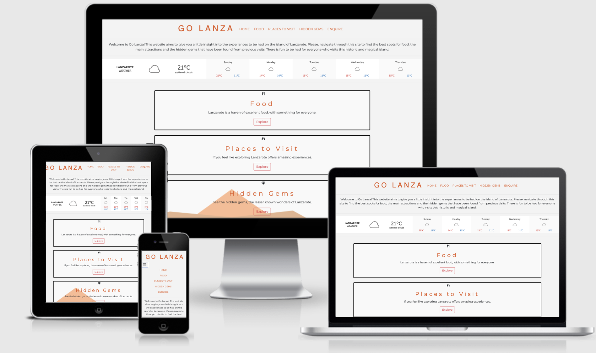
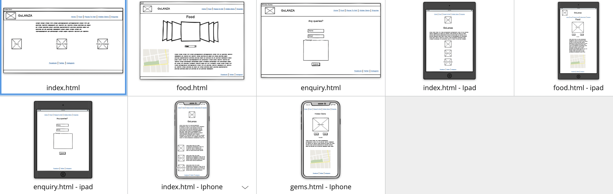

# Go Lanza

## [Table of Contents]()
- [Project Goals](#Project-goals)

- [User Stories](#User-Stories)
  - [User Goals](#User-Goals)
  - [New User Goals](#New-User-Goals)
  - [Returning User Goals](#Returning-User-Goals)
  - [Owner Goals](#Owner-Goals)
  - [User Potential](#User-Potential)
  - [This Website](#This-Website)

- [User Design](#User-Design)
  - [Strategy](#Strategy)
  - [Scope](#Scope)
  - [Future Scope](#Future-Scope)
  - [Structure](#Structure)
  - [Design](#Design)
  - [Color Scheme](#Color-Scheme)
  - [Typography](#Typograpghy)
  - [Imagery](#Imagery)

- [Wireframes](#Wireframes)
- [Features](#Features)
  - [Future Features](#Future-Features)
- [Technology Used](#Technology-Used)
- [Syntax](#Syntax)
- [Testing](#Testing)
  - [Code Validation](#Code-Validation)
  - [User Story Testing](#user-stories-testing)
  - [Owner Story Testing](#owner-stories-testing)
  - [New User Story Testing](#new-user-stories-testing)
  - [Returning User Story Testing](#returning-user-stories-testing)

- [Deployment](#Deployment)
- [Credit](#credits)

  

## Project Goals
This is the main website for a fictitious tourism company who aim to educate visitors and potential visitors to the island of Lanzarote. 
The Go Lanza website will be responsive on all devices focusing on mobile first design, also ensuring visitors have a unique user experience. 
This website will be aimed at users who are looking to travel to Lanzarote and want to know the best spots for food, tourist attractions and the lesser-known attractions the island has to offer. 
All of this readily available information will be displayed clearly and in hierarchy of importance on each page. 
The navigation bar, which allows you to readily access specific information on the site, interactive features, internal website links showing the user further information on specific topics, and aesthetically pleasing, 
relevant imagery of Lanzarote and it's attractions will all be employed to offer the user a wholesome and informative experience. 
Furthermore, users will have the visual and interactive aid of Google Maps to geographically understand where all these attractions are located on the island.

## User Stories

### User Goals
* As a user, I want to be able to access the website, regardless of the device I am using.
* As a user, I want to be able to easily navigate to other sections of the website regardless of the current section I'm viewing.
* As a user, I expect all links of the site to be in full working order - and to be able to easily access any social media accounts relative to the company. 

### New User Goals
* As a new user, I want it to be immdiately obvious what the website is about and what it can offer me.
* As a new user, I want to know where the best places to eat are on the Island. 
* As a new user, I want to have visual aids so I can see what is being described and be more informed. 
* As a new user, I want to be able to access any social media accounts the tourism site has to find additional information.
* As a new user I would like to find a contact form so I can get in touch for any queries.
* As a new user, I want a clear navigation menu, so I can operate the site easily.

### Returning User Goals
* As a returning user, I would like to look for further content and information to heighten my time on the Island.
* As a returning user, I want to be able to see find the location of other attractions and points of interest.
* As a returning user, I want to find out more detailed information on specific locations, attractions and restaurants.

### Owner Goals
* Publicity for the attractions and experiances that Lanzarote has to offer. 
* Bigger audience so as many people as possible are aware of what you can do when visiting.
* To be able to answer and reply to queires users may have.
* Advertise attractions and resturants that can be located on lanzarote.
* Offer an interactive site that keeps users interested.
* Use interactive methods such as Google Maps so users can ascertain the location of points of interest.
* The content provided within this website is primarily to ensure users are aware of what can be experianced once they arrive. 
  It is not designed to be a one stop site were you can book an entire holiday with flights and accomodation.
  This websites primary focus is to be an informal, casual website people can visit at their leisure to find inspiration for the experiances they can pursue should they wish to.

### User Potential
* Potential vistors of Lanzarote.
* Researchers wanting to know more about Lanzarote. 
* Past visitors of Lanzarote.
* Residents of Lanzarote.  

### This website
* Offers a clean, consise and simplistic journey into finding out what there is to do and explore on the Island of Lanzarote.
* Offers a means to use Google Maps in order to find an accurate location for the attractions.
* Provides clear information and is fully responsive. 

## User Design

### Strategy
* With the main goal for this website to educate users into being aware of what you can do in Lanzarote the use of simple, 
  aesthetically pleasing and relevant imagery will allow the user to focus on the content, without being distracted. 
  The design of the site needs to complement the content it is delivering. 
* The contact form allows customers to engage further with the Go Lanza company, it ensures that any further information needed can be requested. 
  To ensure this happens, the website needs to be engaging with an suitable user experience to keep the visitor on the site.
* This website is aimed at users who want to be aware of the experiences Lanzarote has to offer. 
  There is no pressure to pursue these attractions. Moreover, there are different types of attractions to suit different types of potential users. T
  he main attractions that Lanzarote is famous for, the lesser-known attractions which might suit users looking for a more subtle experience and the restaurants that can be visited for anyone who wants to prioritise enjoying highly rated food.

### Scope
* Responsive website for any viewing device size.
* Responsive and interactive navigation bar.
* Relevant images showing the attractions mentioned on the site and useful information accompanying the attractions.
* Implementation of API's to display information to the user.
* Producing and interactive website with clickable features that allow the user to find further information about the different attractions.
* A contact page that includes a simple form that sends emails using Emailjs.
* Internal page links that allow the user to navigate the website efficiently.

#### Future Scope
**Potential for future implementation**
* An 'About' section.
* A seciton that allows past visitors to the mentioned attractions to leave reviews.
* The ability for users to add further attractions not yet mentioned on the site.
* An interactive blog or newsletter. 

### Structure
* Top level - 
    * Simple title with navigation in header. This will be responsive and across all pages of website.
* Body - 
    * Main elements found here, depicting important information, relavant to the current page user is on.
    * There will be button elements that enable the user to navigate the content easily and simply.
    * Dependent on the page, there will be images with accompanying information for the user to discover.
* Footer - 
    * Footer section will hold any links to social media accounts
    * Copyright information also stored here. 

### Design

#### Color Scheme
* The color of the scheme of the site was decided by using natural warm colors that can be easily associated with a sunny destination such as Lanzarote.
* The color of #e35c27, complements the main and overall color dervived from the backfround image. 
* Where suitable the color black was used for text against a white background, these are contrasting colors that allow the user to easily read the information.
* With a neutral background color, the images used would not be too contrasting on the site when loaded.  

#### Typography
* Two fonts were used throughout this website. Font utilised for the logo and headings is Londrina. The second font utilised was the Montserrat font. Both of these fonts are of the serif typeface, therefore Sans Serif will be used as the fallback font in case there is an issue when importing the fonts, or browsers not supporting these. 
  These fonts were imported via Google Fonts and both completement each other giving a visually pleasing user experience.

#### Imagery
* Images of the attractions were of vital importance as it needed to showcase the attractions highlighted by the website. 
* Font icons will be used throughout the website imported from [Font Awesome](https://fontawesome.com/). 
  These will be used to further emphasise the different sections of the website. 
  Using these icons adds a simple, effective and a subtle touch to the site that allows the user to understand what each section relates to. 
  The icons will be relevant to the different section headings of the site.

# Wireframes
I Used Balsamiq to generate my Wireframes.

# Features
* Functioning Nav bar with working links.
* Responsive images.
* Functioning contact form. 
* Buttons that utilise Jquery for further interactivity.

## Future Features
- Further features could include other images of other attractions.
- Utlising the Trip Advisor API for further information.
- Adding further JavaScript to make website more interactive such as when you click on markers a small description of what that marker is for pops up.

# Technology Used
### BeFunky 
  - used for resizing images used.

### Upsplash 
  - used to source some imagery.
### Trip Advisor 
  - also used for some images and information.
* GitHub.
### Weather API 
* Weather widgit code sourced from weatherwidgit.io.
### EmailJS.
  - This allowed me to make a fully responsive and dynamic fonctact form.
### Responsive Carousal
  - some of the code for this was taken from bootstrap.

## Syntax & Languages

### HTML5

- HTML5 is a markup language used for structuring.

### CSS

- Cascading Style Sheets (CSS) is a style sheet language used for describing and adding desing to the presentation of a website.

### Javascript

- Javascript object-oriented language with first-class functions and objects.
### JQuery
- jQuery is a JavaScript library that allows web developers to add extra functionality to their websites with ease. 

# Testing
* All navigations links tested across all pages, no issues.
* Text fields in contact form all working correctly.
* Site fully responsive to all breakpoints.
## Google Lighthouse
* Google Lighthouse report generated a SEO of 91 and accessability of 90. Unfortunately performace was marked at 76 due to imagery used and loading times of some pages. Best preactices given a grade of 89.
## Functionality Testing
- I used Chrome developer tools throughout the creation and devlopemnt of this site.
## Combatability Testing
-  The site has been tested across multiple virtual mobile devices and browsers. I checked all supported devices in both Mozilla web developer tolls and Chrome developer tools. 
## Code Validation
- HTML has been passed through W3 Validator with no issues or warnings. 
- CSS has passed through W3 JigSaw validator with no issues. 
- JS - Passed through JSHint with no major issues some warnings to advise certain synatx is available in 'ES6 (use 'esversion: 6')'.

## User Stories Testing
- As a user, I want to be able to access the website, regardless of the device I am using.
  > The website has been tested across virtual different devices with no issues.

- As a user, I want to be able to easily navigate to other sections of the website regardless of the current section I'm viewing.
  > Fully responiive navigation bar that allows you to visit any part of the site with ease.

- As a user, I expect all links of the site to be in full working order - and to be able to easily access any social media accounts relative to the company. 
  > All links have been tested and confirmed as working.  

## Owner Stories Testing
- Publicity for the attractions and experiances that Lanzarote has to offer.
  > The site is a hub that can be used for potential visitors, the site allows users to see photos of attractions. 

- Bigger audience so as many people as possible are aware of what you can do when visiting.
  > Site has an SEO of 91.

- To be able to answer and reply to queires users may have.
  > Site has a fully functional contact form with EmailJS ensuring ane queries can be responded to.

- Use interactive methods such as Google Maps so users can ascertain the location of points of interest.
  > Google Maps API succeefully implemented onto site.

## New User Stories Testing

- As a new user, I want it to be immdiately obvious what the website is about and what it can offer me.
  > Paragraph that shows immdiatatly onload allows the user to discover what the site is about. Clear labels indicate what resources and each page will include. 

- As a new user, I want to know where the best places to eat are on the Island. 
    > First page allows the user to flick through images of popular restaurants on the island. With a map directly underneath showing locations clearly with markers.

- As a new user, I want to have visual aids so I can see what is being described and be more informed.
  >  Each page has carousel showing multiple images with captions.

- As a new user, I want to be able to access any social media accounts the tourism site has to find additional information.
  > In footer there are testing working links to relavent social media channels, should the accounts exist.

- As a new user I would like to find a contact form so I can get in touch for any queries.  
  > Contactg form is fully functional for any queries. 

- As a new user, I want a clear navigation menu, so I can operate the site easily.
  Menu is fully responsive across all devices.

## Returning User Stories Testing
* As a returning user, I would like to look for further content and information to heighten my time on the Island.
  >The site has a contact form that cna be used to enquire about further content on the webiste

* As a returning user, I want to be able to see the location of other attractions and points of interest.
  > This can be achieved using Google Map API.

* As a returning user, I want to find out more detailed information on specific locations, attractions and restaurants.
  > The site encourages users for futher information to look on trip advisor webiste and offers a link to the site on the index.html.

# Deployment 
* To deploy this page to GitHub Pages from its GitHub repository, the following steps were taken:

* Log into GitHub. From the list of repositories on the screen
* Select Go-Lanza.
* Select Settings.
* Scroll down to the GitHub Pages section.
* Under Source click the drop-down menu labelled None
* Select Master Branch On selecting Master Branch the page is automatically refreshed, the website is now deployed.
* Scroll back down to the GitHub Pages section to retrieve the link to the deployed website.
* To clone this project from GitHub:

* Follow this link to the Project GitHub repository. Under the repository name, click "Clone or download".
* In the Clone with HTTPs section, copy the clone URL for the repository. In your local IDE open Git Bash.
* Type git clone, and then paste the URL you copied in Step 3. git clone https://github.com/USERNAME/REPOSITORY Press Enter.
* Your local clone will be created. Further reading and troubleshooting on cloning a repository from GitHub here. Deployment: The site will be deployed by https://pages.github.com/

# Credit
* To complete this project I used the Code Institute student template: gitpod full template
* Ideas and knowledge library:
  - w3schools.com
  - css-tricks.com
  - getbootstrap.com/docs I used code for navbar, jumbotron and card from Bootstrap.
  - Youtube for certain tutorial (all mentioned within comments in code)

## Google Map
- Google Map API used for map features within project.
 
  